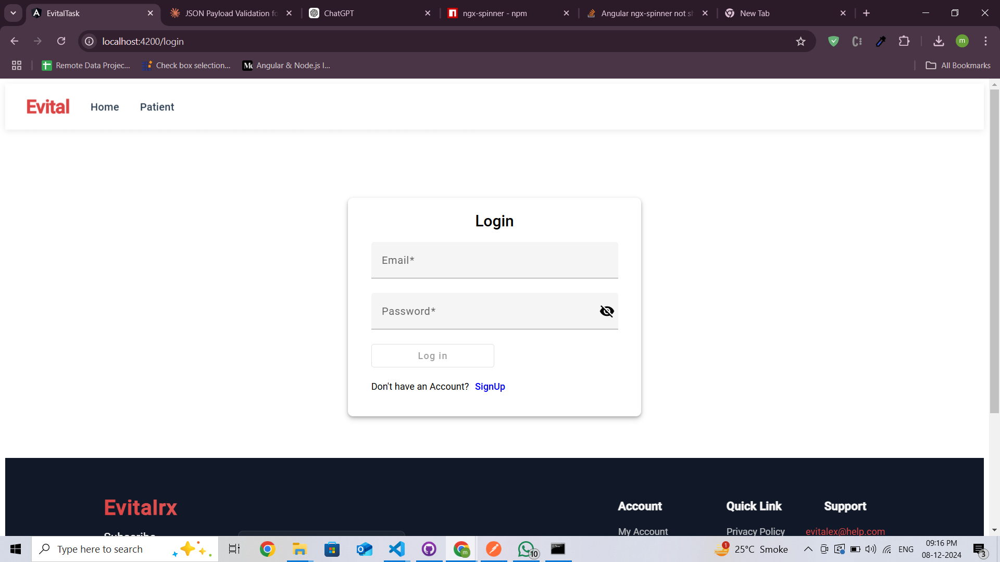
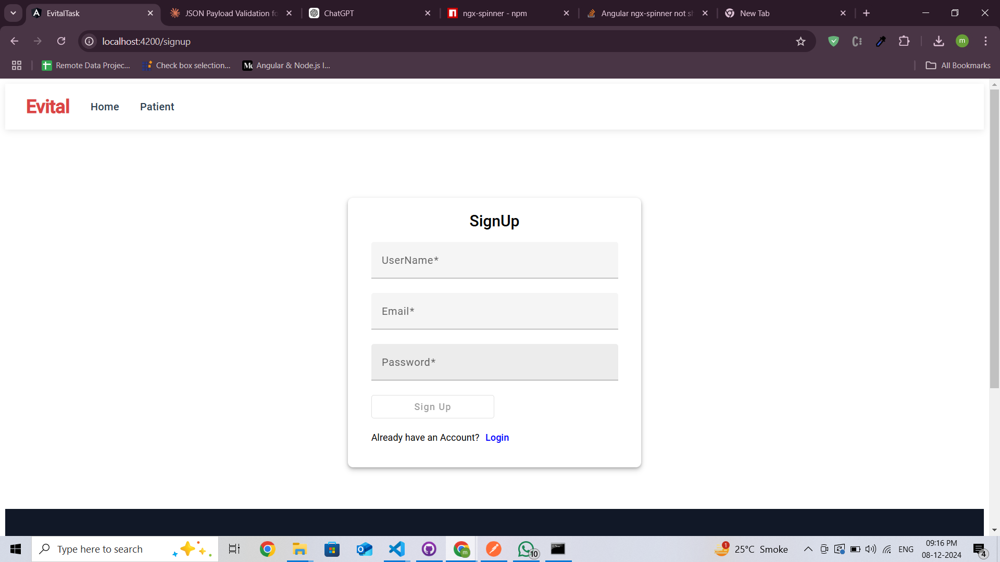
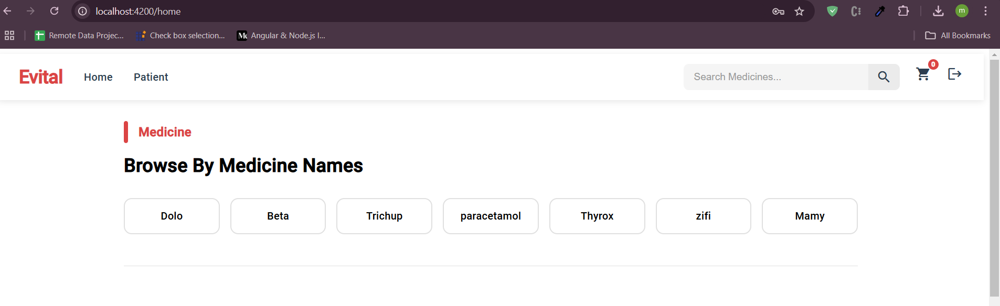
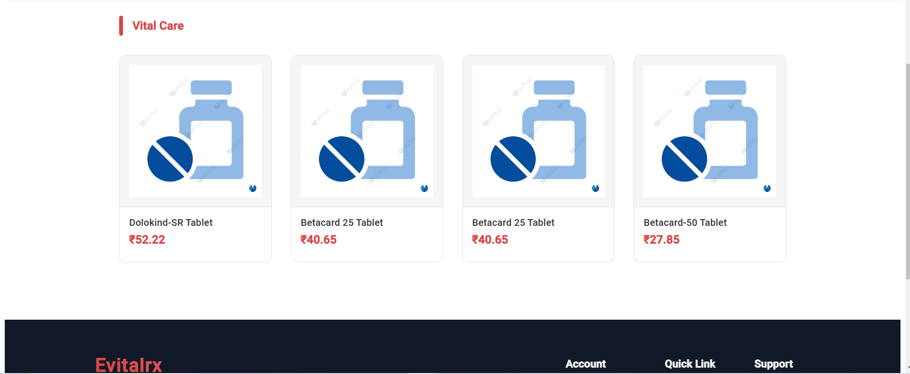
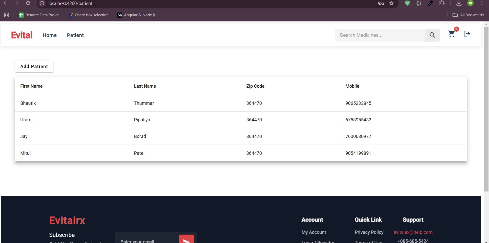
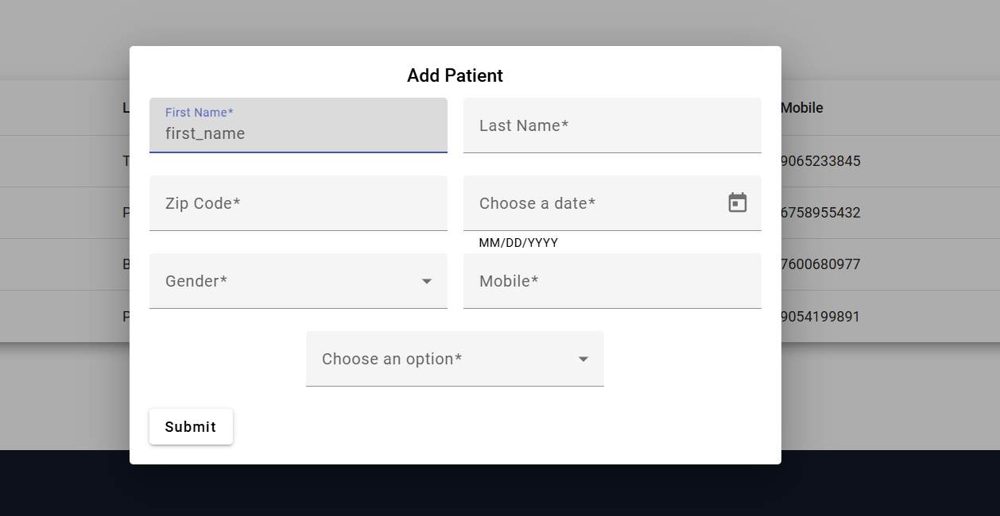
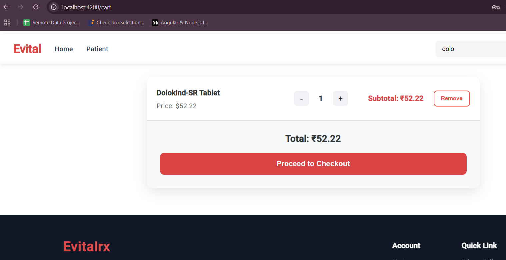
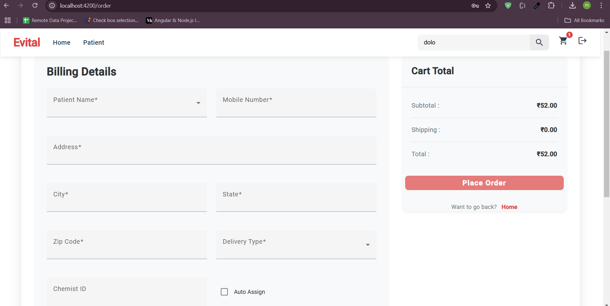
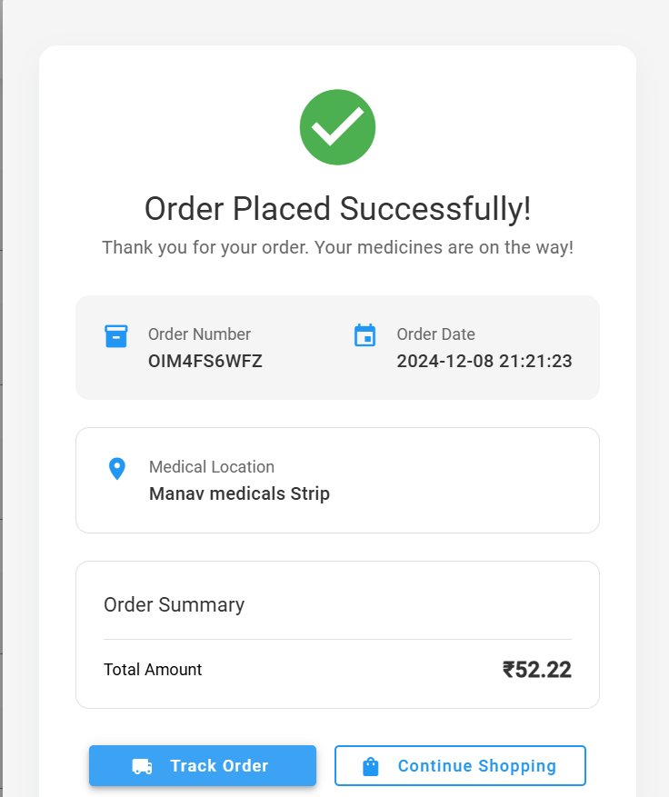

Here’s the updated README with a revised title:

---

# **EvitalRx - Your Trusted Online Medicine Ordering Platform 💊**

Welcome to **EvitalRx**, your go-to platform for effortless online medicine ordering. With features like patient management, intelligent search, and secure authentication, EvitalRx transforms how you manage and purchase medications. From adding medicines to your cart to a seamless checkout experience tailored to patient-specific details, our platform is designed for simplicity and convenience. 🌟📦

---

## Table of Contents 📚

- [About Us ℹ️](#about-us-ℹ️)
- [Features 🛠️](#features-️)
- [Why Choose EvitalRx 🌟](#why-choose-evitalrx-)
- [How to Use the Platform 🖥️](#how-to-use-the-platform-️)
- [Page Under Development 🚧](#page-under-development-🚧)
- [Demo Screenshots 📸](#demo-screenshots-📸)
- [Contact Us 📞](#contact-us-📞)

---

## About Us ℹ️

At **EvitalRx**, we aim to simplify the way users search for, manage, and order medicines online. With a focus on reliability and ease of use, we provide features like smart medicine search, patient tracking, and secure authentication to make online ordering hassle-free. 💼💊

---

## Features 🛠️

Explore the standout features of **EvitalRx**:

- **Secure User Authentication**  
  Login, signup, and routing prevention with Firebase Authentication and AuthGuard.

- **Patient Management**  
  Add and manage patient details to assign medicines and track orders.

- **Smart Medicine Search**  
  - Search medicines by name.  
  - Get suggestions for nearly matching terms.  
  - View top 5-6 most searched medicines on the dashboard.

- **Comprehensive Cart Management**  
  - Add medicines to the cart.  
  - Receive alerts for duplicate items in the cart.  
  - View cart details with quantities and assigned patients.

- **Cart Options**  
  - **Clear All**: Remove all cart items.  
  - **Back to Home**: Return to the dashboard.  
  - **Checkout**: Finalize orders with patient and address details.

- **Order Tracking**  
  Upon checkout, receive tracking credentials via a popup confirmation.

- **Data Persistence**  
  - Securely store user data, patient IDs, and order history in Firebase.  
  - Preserve cart and checkout data with local storage to prevent loss during network issues.

- **Performance Optimization**  
  Lazy loading for faster rendering and RxJS Observable Services for smooth data communication.

---

## Why Choose EvitalRx 🌟

- **Ease of Use**: Simplified workflows for managing orders.  
- **Smart Search**: Accurate results even for typos or partial names.  
- **Data Security**: Robust storage solutions via Firebase.  
- **Reliability**: Retain data even during connectivity disruptions.  
- **Comprehensive Features**: Manage everything from patients to order tracking in one place.

---

## How to Use the Platform 🖥️

1. **Sign Up/Login**  
   Securely create an account or log in. Use the "Forgot Password" feature for recovery.  

2. **Dashboard**  
   - Search for medicines by name or browse top-searched items.  
   - Add medicines to your cart.  
   - Manage patients by selecting or adding their details.  

3. **Cart Management**  
   - Specify medicine quantities and assign them to patients.  
   - Use actions like **Clear All**, **Back to Home**, or **Checkout**.

4. **Checkout**  
   - Enter delivery and client details.  
   - Confirm your order and get tracking details via popup.

5. **Persistent Data**  
   Reload cart or checkout pages without data loss, even during connectivity issues.

---

## Demo Screenshots 📸

1. **Login**  
   

2. **Register**  
   

3. **Dashboard**  
   
   

4. **Patient details**
    

5. **Add Patient**  
   

6. **Cart**  
   

7. **Checkout**  
   

8. **Order Confirmation**  
   

